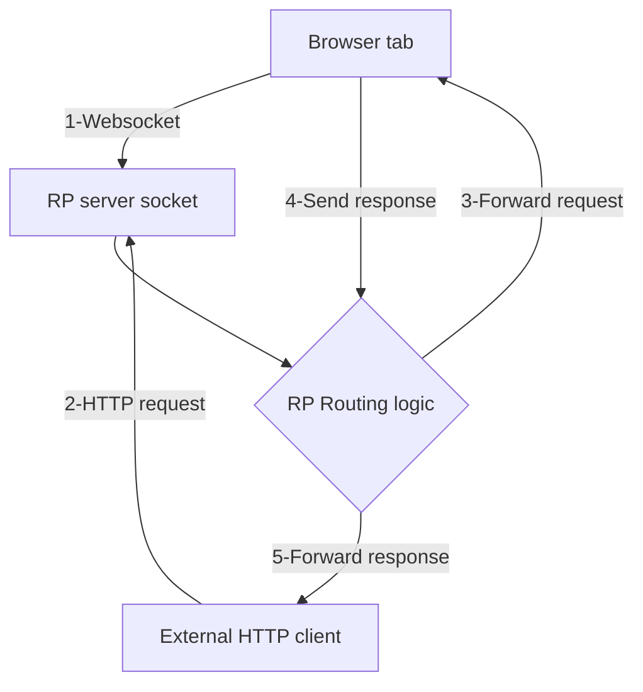

# Your browser tab act as a HTTP Server, almost
Okay, it still needs a friend.


This project is a JavaScript-based (or can be WebAssembly (WASM)-based) HTTP handler but in a reverse tcp way. It uses WebSockets to establish a tunnel between the client and the server, allowing for real-time communication.

In this demo project, we connect the server (reverse proxy) websocket from browser tab and act like a dependency. The server relays incoming requests to the webpage websocket handler. So now a webpage can act as a HTTP server.

> [!IMPORTANT]
> If server is hosted in a public network, the webpage can be publicly accessible, use with caution.



## Getting Started

### Prerequisites

- .NET 8.0 SDK

### Installation

1. Clone the repository:
    ```sh
    git clone https://github.com/shackerd/webpage-act-as-http-server.git
    cd wasm-http-reverse-proxy
    ```

2. Install the dependencies:
    ```sh
    dotnet restore
    ```

### Running the Application

1. Build and run the application:
    ```sh
    dotnet run
    ```

2. Open your browser and navigate to `http://localhost:5230/index.html`.

### Usage

- Click the "Connect" button to establish a WebSocket connection.
- Open generated url in browser / curl
- Click the "Disconnect" button to close the WebSocket connection.
- Click the "Clear" button to clear the output.
- Check the "Send 403" checkbox to send a 403 Forbidden response.
- Check the "Benchmark" checkbox to enable benchmarking.

## Project Details

### Controllers

- **WebSocketController**: Handles WebSocket connections and manages the tunnel creation.
  - `Tunnel()`: Creates a unique identifier for the WebSocket client and returns the WebSocket URL.
  - `Get(string name)`: Establishes the WebSocket connection and keeps it alive.

- **RouterController**: Routes HTTP requests to the WebSocket clients.
  - `Route(string name)`: Sends HTTP requests to the WebSocket client and receives responses.

### Classes

- **WebSocketListener**: Manages the WebSocket connection and handles sending and receiving messages.
- **TunnelClient**: Represents a WebSocket client with a unique identifier.
- **TunnelClientFactory**: Creates instances of `TunnelClient`.
- **TunnelClientRepository**: Stores and manages `TunnelClient` instances.

